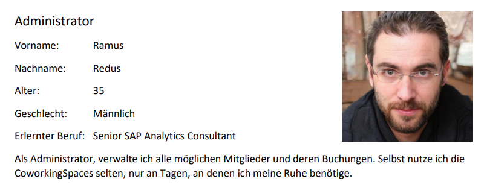
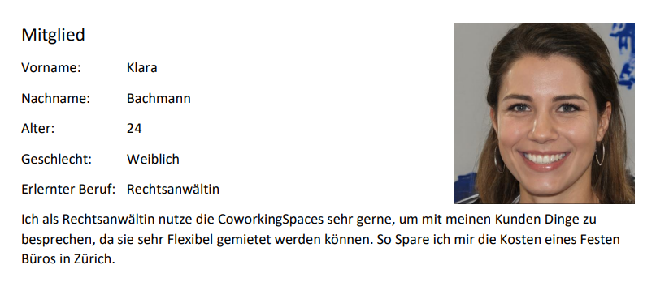
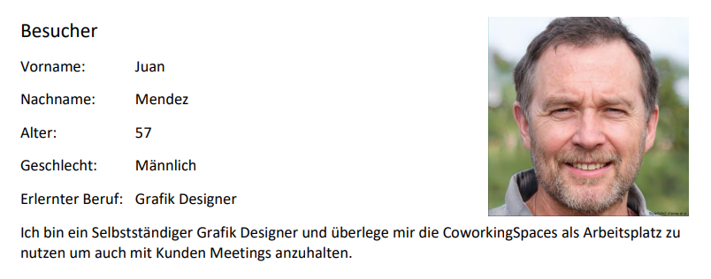
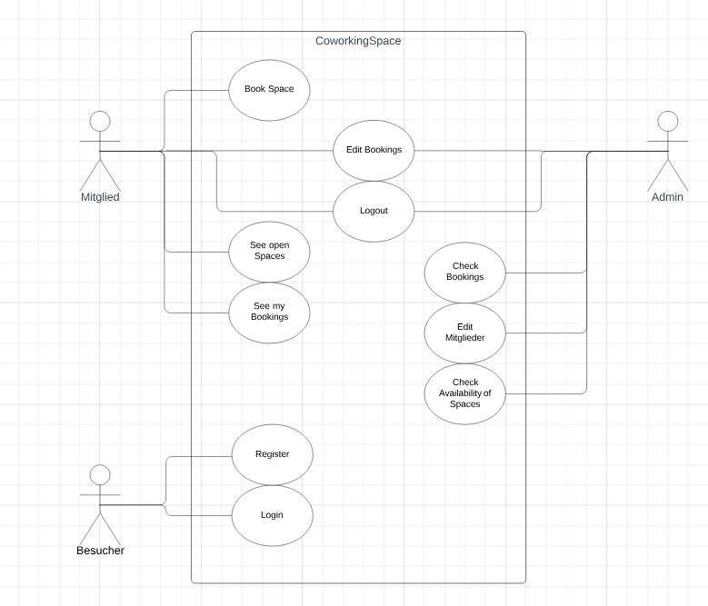

# CoworkingSpace

## Aufgabenstellung

#### Anforderungen

Folgende funktionalen Anwendungsfälle sollen mindestens im Prototypen implementiert werden:

- [ ] Als **Besucher** möchte ich mich mit meinem Vor- und Nachnamen, meiner E-Mail-Adresse und einem Passwort
registrieren, damit ich die Rolle Mitglied bekommen kann.

- [ ] Als **Besucher** möchte ich mich mit meiner E-Mail-Adresse und meinem Passwort anmelden, damit ich mich als
**Mitglied** oder **Administrator** authentifizieren kann.

- [ ] Als **Mitglied** möchte ich halbe und ganze Tage an bestimmten Daten im Coworking Space als Buchung anfragen,
damit ich die Angebote des Coworking Space nutzen kann.

- [ ] Als **Mitglied** möchte ich den Status meiner Buchungen überprüfen, damit ich erfahre, ob meine Buchung
bestätigt oder abgelehnt wurde.

- [ ] Als **Mitglied** kann ich meine zukünftigen Buchungen stornieren, damit ich auf Veränderungen in meiner
Terminplanung reagieren kann.

- [ ] Als **Administrator** kann ich Mitglieder verwalten (erstellen, bearbeiten, löschen), damit ich die Mitglieder
organisieren kann.

- [ ] Als **Administrator** kann ich Buchungsanfragen akzeptieren und ablehnen, damit die Mitglieder das Angebot des
Coworking Space nutzen können.

- [ ] Als **Administrator** kann ich Buchungen verwalten (erstellen, bearbeiten, löschen), damit ich die Buchungen
organisieren kann.

Folgende nicht-funktionale Anforderungen sollen mindestens im Prototypen umgesetzt werden:

- [ ] Das Datenmodell erfüllt die erste, zweite und dritte Normalform nach der relationalen Entwurfstheorie.

- [ ] Der erste Besucher bekommt nach der Registrierung die Rolle **Administrator** anstatt **Mitglied**.

- [ ] Die Authentifizierung erfolgt mittels JSON Web Token (JWT nach RFC 7519) über den HTTP Header

'Authorization'.

- [ ] Das JWT läuft **24 Stunden** nach der Ausstellung ab und verliert seine Gültigkeit.

- [ ] Das JWT wird **clientseitig** während dessen Lebensdauer persistent **aufbewahrt**.

## Anforderungen analysieren

### Erweiterte Anforderungen

##### Funktional

- [ ] Als **Mitglied** möchte ich eine Übersicht zu meinen Buchungen haben, um meine Buchungen besser zu planen.

- [ ] Als **Mitglied** möchte ich die Verfügbarkeit von Arbeitsplätzen und Räumen in Echtzeit überprüfen können, um meine Buchungsanfragen besser zu planen.

- [ ] Als **Administrator** möchte ich einen Überblick über die Auslastung des Coworking Spaces haben, um Ressourcen effizient zu verwalten.

##### Nicht Funktional

- [ ] 

- [ ]

- [ ]

### Persona

Die Personas sind im Personas.pdf Dokument zu finden. Oder werden hier unten aufgelistet.

#### Admin

#### Mitglied

#### Besucher

### Anwendungsfalldiagramm

## Persistenzschicht planen

### Fachklassendiagramm

## Schnittstelle planen

### Schnittstellenplanung

### Sequenzdiagramm

## Persistenzschicht umsetzen

### Entitäten

### Relationen

### Testdaten

## Schnittstelle umsetzen

### Schnittstelle: Registrierung, Authentifizierung

### Schnittstelle: Verwaltung der eigenen Buchungen (Mitglied)

### Schnittstelle: Verwaltung der Buchungen (Administrator)

### Schnittstelle: Verwaltung von Mitgliedern (Administrator)

### Schnittstelle: Zusätzliche Anforderungen

## Automatische Tests umsetzen

### E2E-Testing: Registrierung, Authentifizierung

### E2E-Testing: Verwaltung der eigenen Buchungen (Mitglied)

### E2E-Testing: Verwaltung der Buchungen

### E2E-Testing: Verwaltung von Mitgliedern

### E2E-Testing: Zusätzlichen Anforderungen

## Projekt organisieren

### README.md

### Schichtentrennung

### Leistungsfähigkeit

### Quellcode

### Versionsgeschichte