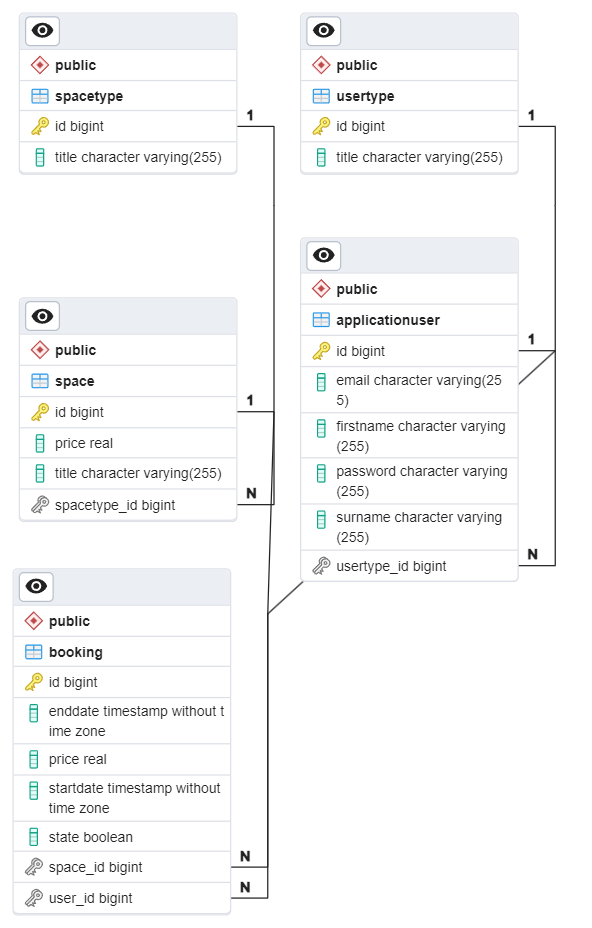

# CoworkingSpace

## Aufgabenstellung

### Anforderungen

Folgende funktionalen Anwendungsfälle sollen mindestens im Prototypen implementiert werden:

- [X] Als **Besucher** möchte ich mich mit meinem Vor- und Nachnamen, meiner E-Mail-Adresse und einem Passwort
registrieren, damit ich die Rolle Mitglied bekommen kann.

- [X] Als **Besucher** möchte ich mich mit meiner E-Mail-Adresse und meinem Passwort anmelden, damit ich mich als
**Mitglied** oder **Administrator** authentifizieren kann.

- [X] Als **Mitglied** möchte ich halbe und ganze Tage an bestimmten Daten im Coworking Space als Buchung anfragen,
damit ich die Angebote des Coworking Space nutzen kann.

- [X] Als **Mitglied** möchte ich den Status meiner Buchungen überprüfen, damit ich erfahre, ob meine Buchung
bestätigt oder abgelehnt wurde.

- [X] Als **Mitglied** kann ich meine zukünftigen Buchungen stornieren, damit ich auf Veränderungen in meiner
Terminplanung reagieren kann.

- [X] Als **Administrator** kann ich Mitglieder verwalten (erstellen, bearbeiten, löschen), damit ich die Mitglieder
organisieren kann.

- [X] Als **Administrator** kann ich Buchungsanfragen akzeptieren und ablehnen, damit die Mitglieder das Angebot des
Coworking Space nutzen können.

- [X] Als **Administrator** kann ich Buchungen verwalten (erstellen, bearbeiten, löschen), damit ich die Buchungen
organisieren kann.

Folgende nicht-funktionale Anforderungen sollen mindestens im Prototypen umgesetzt werden:

- [X] Das Datenmodell erfüllt die erste, zweite und dritte Normalform nach der relationalen Entwurfstheorie.

- [X] Der erste Besucher bekommt nach der Registrierung die Rolle **Administrator** anstatt **Mitglied**.

- [X] Die Authentifizierung erfolgt mittels JSON Web Token (JWT nach RFC 7519) über den HTTP Header

'Authorization'.

- [X] Das JWT läuft **24 Stunden** nach der Ausstellung ab und verliert seine Gültigkeit.

- [X] Das JWT wird **clientseitig** während dessen Lebensdauer persistent **aufbewahrt**.

## Anforderungen analysieren

### Erweiterte Anforderungen

#### Funktional

- [ ] Als **Mitglied** möchte ich eine Übersicht zu meinen Buchungen haben, um meine Buchungen besser zu planen.

- [ ] Als **Mitglied** möchte ich die Verfügbarkeit von Arbeitsplätzen und Räumen in Echtzeit überprüfen können, um meine Buchungsanfragen besser zu planen.

- [X] Als **Administrator** Mitglieder suspendieren können, damit sie, wenn sie sich erneut einloggen, bis zur manuellen desuspendierung keine 
Spaces mehr buchen können.

#### Nicht Funktional

- [X] Es werden an Usern **nur seine eigenen** Daten zurückgegeben, damit die Privatsphäre der User gewahrt bleibt.

- [X] Die Passwörter der User werden verschlüsselt.

- [X] Das Programm ist mit Docker umgesetzt um eine einfache Installation zu ermöglichen.

### Persona

Die Personas sind im Personas.pdf Dokument zu finden. Oder werden hier unten aufgelistet.

#### Admin

#### Mitglied

#### Besucher

### Anwendungsfalldiagramm

## Persistenzschicht planen

### Fachklassendiagramm  

## Schnittstelle planen

### Schnittstellenplanung

Die Schnittstellen wurden nach der OpenAPI Spzifikation und Swagger erstellt, um einen besseren Überblick zu haben.

Und ein vorher nachher Vergleich zu haben.

Die Schnittstellen sind unter 'resources/Endpoint Planung.pdf' zu finden.

### Sequenzdiagramm

## Persistenzschicht umsetzen

### Entitäten & Relationen

### Testdaten

Die Test Daten werden im File 'src/main/java/ch/zli/m223/service/SetUpService.java' erstellt und in die Datenbank persistiert.

Es werden je zwei Objekte pro Entität erstellt.

## Schnittstelle umsetzen

### Schnittstelle: Registrierung, Authentifizierung

### Schnittstelle: Verwaltung der eigenen Buchungen (Mitglied)

### Schnittstelle: Verwaltung der Buchungen (Administrator)

### Schnittstelle: Verwaltung von Mitgliedern (Administrator)

### Schnittstelle: Zusätzliche Anforderungen

## Automatische Tests umsetzen

Die Tests sind via Postman gelöst, die Collection ist unter 'Postman/Collection.json' zu finden.

Wenn man die Collection ausführt werden die Tests in dieser genauen Reihenfolge ausgeführt:

***Wichtig:*** Die Tests müssen in dieser Reihenfolge ausgeführt werden, da die Tests aufeinander aufbauen. Heisst unter anderem, dass es sein 

kann, dass man ein erstelltes Bearer Token aus dem ersten Test in die Auth Option kopieren muss.

- E2E-Testing: Registrierung, Authentifizierung

- E2E-Testing: Verwaltung der eigenen Buchungen (Mitglied)  

- E2E-Testing: Verwaltung der Buchungen

- E2E-Testing: Verwaltung von Mitgliedern

- E2E-Testing: Zusätzlichen Anforderungen

## Projekt organisieren

### README.md

### Schichtentrennung

### Leistungsfähigkeit

### Quellcode

### Versionsgeschichte
